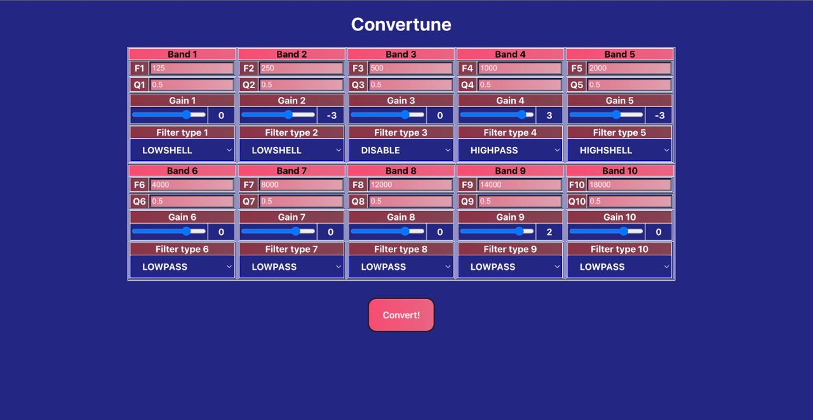

Audio processor
-
Requirements:
-
1) NodeJS Version 19+
2) CMake 3.12+
3) NPM - node package manager
4) GCC (Linux)

How to run:
-
1) Run run.sh script

If you want to change another file: you need to add your file by path:  
-
1) You need to add your file by path:Audio_processor/Chain_scalar/test_signal/ ;
2) You need to change it in Audio_processor/Chain_scalar/src/main.c on the 45 line;
Also you can change output file name on 46 line.

Result: Audio_processor/Chain_scalar/test_signal/newww.

Screenshots:
